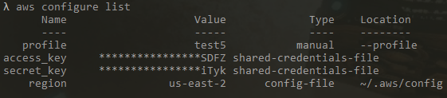
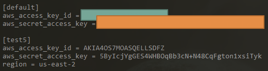

# Nodejs and AWS IoT Tester  

## Setup AWS  
- AWS IoT Policies   
- AWS IoT Thing  
- AWS Cognito User   
- AWS Cognito Identity Pool  
- AWS IAM Role   
```javascript  
{
    "Version": "2012-10-17",
    "Statement": [
        {
            "Effect": "Allow",
            "Action": [
                "mobileanalytics:PutEvents",
                "cognito-sync:*",
                "cognito-identity:*"
            ],
            "Resource": [
                "*"
            ]
        },
        {
            "Effect": "Allow",
            "Action": [
                "iot:*"
            ],
            "Resource": [
                "*"
            ]
        }
    ]
}
```  
- AWS IAM User  
Add this role in your `IAM User: AmazonCognitoDeveloperAuthenticatedIdentities`  

## Setup Nodejs  
`git clone https://github.com/ollolollollooloo/aws-iot-nodejs-tester.git`  
`cd aws-iot-nodejs-tester`  
`npm install`  
Replace certs folder  
Replace path.resolve according to your certs folder and name  

## To check current active profile in your computer windows 10  
run `aws configure list`  
  

## To check all profile in your computer windows 10  
run `vim ~/.aws/credentials`  
  

## To set specific profile in your computer windows 10  
run `setx AWS_PROFILE test5`  
check again the current active profile `aws configure list`  

## Unable to find .aws directory  
You have to run `aws configure` to have it create the `~/.aws` directory  

## Usage  
run `node subscribe.js`  
run `node publish.js`  

## Take note  
If both end are communicating, that means AWS IoT has been successfully configured.  

## Youtube Tutorial
By Following this Tutorial  
https://youtu.be/p8Vb9l2dW6Q
  
